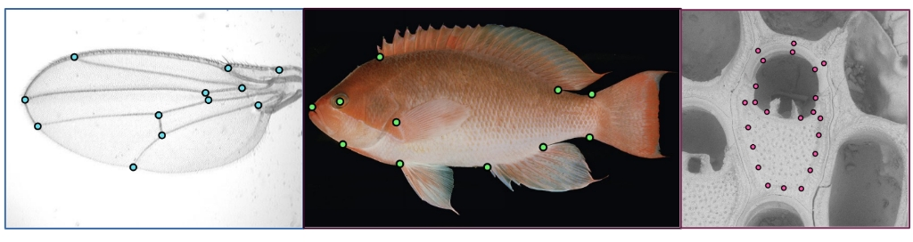

# ml-morph [](https://zenodo.org/badge/latestdoi/195575274)

Machine-learning tools for landmark-based morphometrics


Porto, A. and Voje, K.L., 2020. ML‐morph: A fast, accurate and general approach for automated detection and landmarking of biological structures in images. Methods in Ecology and Evolution, 11(4), pp.500-512.



## Python Dependencies

- numpy>=1.13.3
- pandas>=0.22.0
- dlib>=19.7.0
- opencv-python>=3.4.0.12

If their dependencies are satisfied, these modules can be installed using:

    pip install -r requirements.txt

## Optional Dependencies
- imglab

For those who want to visualize the xml files produced by the pipeline, we recommend installing the [`imglab`](https://github.com/davisking/dlib/tree/master/tools/imglab) tool that is included in the `dlib 19.7.0` source code. 
Please refer to the [`original repository`](https://github.com/davisking/dlib/tree/master/tools/imglab) for installation details and basic usage.
An alternative [`version of imglab`](https://imglab.in/) is also available and can be used directly from the web browser.

## Installation notes and general issues
For Mac users, a series of dependencies for `dlib>=19.7.0` will need to be installed before it can be used. A detailed protocol can be found [here](https://medium.com/@210/install-dlib-on-mac-ff9f4d03ad8).

For windows users, the `dlib>=19.7.0` installation will sometimes fail. An alternative way to install it is to use a `.whl`:
    
    pip install https://pypi.python.org/packages/da/06/bd3e241c4eb0a662914b3b4875fc52dd176a9db0d4a2c915ac2ad8800e9e/dlib-19.7.0-cp36-cp36m-win_amd64.whl#md5=b7330a5b2d46420343fbed5df69e6a3f
    
Also note that while **ml-morph** can handle multiple image file formats, some care is needed with regards to the presence of special characters in image filenames. So far, we have only had problems with `&`, but it is possible that other special characters might lead the software to throw out an error. 

## Usage
**ml-morph** uses a combination of [`object detection`](https://lear.inrialpes.fr/people/triggs/pubs/Dalal-cvpr05.pdf) with [`shape prediction`](http://www.nada.kth.se/~sullivan/Papers/Kazemi_cvpr14.pdf) to perform automated landmarking in images of semi-rigid biological structures. To generate such detectors and predictors, we need to train machine learning models using manually annotated datasets. These manually annotated datasets can be generated using the `imglab` tool, or (alternatively) can also be generated by converting traditional morphometric landmark files (`tps` and `standard XY coordinate`).
 
The pipeline itself has four mains components, which should be applied in sequence: 
1. Preprocessing `preprocessing.py`
2. Training and Testing object detectors `detector_trainer.py` `detector_tester.py`
3. Training and testing shape predictors `shape_trainer.py` `shape_tester.py`
4. Predicting the landmark positions in a new set of images `prediction.py` 


### Vignette

Here, we will go through the **ml-morph** pipeline using a tiny fly wing dataset (see `image-examples`) to illustrate the full-training process. This dataset contains `58` images of drosophilid wings, which have been annotated for `12` landmarks (see `landmark-examples`). We have provided landmark annotations in two file formats traditionally used by the morphometric community. While this dataset is too small to generate high performing detectors and predictors, it still allows us to demonstrate how this software can be used. 


#### 1) Preprocessing (_preprocessing.py_)

In the preprocessing step, **ml-morph** will split a user-defined image folder into `train` and `test` sets. When splitting the image files, **ml-morph** will convert all image files to `.jpg` and _(optionally)_ also generate the `train.xml` and `test.xml` downstream files from previously acquired annotations. The xml files generated during this step contain the landmark and bounding box annotations for each image in the `train` and `test` folders. Please see the following scenarios for usage details:

##### option 1 - No previous annotation 
When creating a training and testing dataset from scratch, the preprocessing step will only serve to split the images into `train`and `test` sets (80%/20% split). This can be accomplished using:

    python3 preprocessing.py -i image-examples

Once created, the images in the `train`and `test` folders will need to be manually annotated. The user should choose the appropriate software to do so ([`tpsDig`](https://life.bio.sunysb.edu/morph/), [`geomorph`](https://cran.r-project.org/web/packages/geomorph/index.html), [`imglab`](https://github.com/davisking/dlib/tree/master/tools/imglab), to cite a few possibilities). In order to annotate the training images from scratch using [`imglab`](https://github.com/davisking/dlib/tree/master/tools/imglab), simply create the initial `train.xml` file using:

    ./imglab -c train.xml /train

This file can then be annotated, in our example, using the following command:
   
    ./imglab --parts '1 2 3 4 5 6 7 8 9 10 11 12' train.xml

See `./imglab -h` for other usage possibilities and the `imglab` manual for details of the annotation procedure.


##### option 2 - Previously annotated dataset
When creating training and testing sets from previously annotated datasets, the preprocessing step will not only split the images into `train` and `test` sets but also generate the downstream input files (`train.xml` and `test.xml`). Using the  `.tps` annotation file as an example, simply type:

    python3 preprocessing.py -i image-examples -t landmark-examples/tps-example.tps

This command will generate the `train` and `test` folders, as well as the `train.xml` and `test.xml` downstream files.


#### 2) Training and testing object detectors (detector_trainer.py)

In order to train a model to detect fly wings in images, we can use the **ml-morph** detector trainer. Several parameters can be given to the trainer:

    python3 detector_trainer.py --help
    
```
usage: detector_trainer.py [-h] [-d] [-t] [-o] [-n] [-s] [-e] [-c] [-u] [-w]

optional arguments:
  -h, --help           show this help message and exit
  -d , --dataset       training data (default = train.xml)
  -t , --test          (optional) test data. if not provided, the model is not
                       tested
  -o , --out           output filename (default = detector)
  -n , --n-threads     number of threads to be used (default = 1)
  -s , --symmetrical   (True/False) indicating whether objects are bilaterally
                       symmetrical (default = False)
  -e , --epsilon       insensitivity parameter (default = 0.01)
  -c , --c-param       soft margin parameter C (default =5)
  -u , --upsample      upsample limit (default = 0)
  -w , --window-size   (optional) detection window size

```


In the wing example, we have a very small dataset, so we are running the **ml-morph** model trainer with parameters that work reasonably in this context:

    python3 detector_trainer.py -d train.xml -t test.xml -n 7 -w 79000 -e 0.001 -c 15

   
```
Training with C: 15
Training with epsilon: 0.001
Training using 7 threads.
Training with sliding window 428 pixels wide by 184 pixels tall.
```
    
These parameters should not be used, in any way, as default training parameters. Exploration of the **ml-morph** parameter space can have a large impact on improving the final performance of the detection algorithm. Also note that testing of the model is performed immediately after training if the `--test` flag is provided, but not otherwise.
At the end, you should observe something like this:

```
Training complete.
Trained with C: 15
Training with epsilon: 0.001
Trained using 7 threads.
Trained with sliding window 428 pixels wide by 184 pixels tall.
Saved detector to file detector.svm
Training - precision: 1, recall: 1, average precision: 1
Testing - precision: 1, recall: 1, average precision: 1
```

One file is generated during the training process (`detector.svm` or the user-defined name). This file represents the support vector machine (SVM) classifier. With this classifier, one can use **ml-morph** to perform object detection in images of fly wings. 
If the user wants to test a model that was trained in the past, this can be done using:

    python3 detector_tester.py -t test.xml -d detector.svm

```
Testing - precision: 1, recall: 1, average precision: 1
```


#### 3) Training and testing shape predictors (shape_trainer.py)

In order to train a model to predict wing shape, we can use the **ml-morph** shape trainer. Several parameters can be given to the trainer:

    python3 shape_trainer.py --help

```
usage: shape_trainer.py [-h] [-d] [-t] [-o] [-th] [-dp] [-c] [-nu] [-os] [-s]
                        [-f] [-n]

optional arguments:
  -h, --help            show this help message and exit
  -d , --dataset        training data (default = train.xml)
  -t , --test           test data (default = test.xml).if not provided, no
                        testing is done
  -o , --out            output filename (default = predictor)
  -th , --threads       number of threads to be used (default = 1)
  -dp , --tree-depth    choice of tree depth (default = 4)
  -c , --cascade-depth 
                        choice of cascade depth (default = 15)
  -nu , --nu            regularization parameter (default = 0.1)
  -os , --oversampling 
                        oversampling amount (default = 10)
  -s , --test-splits    number of test splits (default = 20)
  -f , --feature-pool-size 
                        choice of feature pool size (default = 500)
  -n , --num-trees      number of regression trees (default = 500)
```


Again, since we have a very small dataset, we are running the **ml-morph** model trainer with parameters that work reasonably in this context:

    python3 shape_trainer.py -d train.xml -t test.xml -th 7 -dp 3 -c 20  -nu 0.08 -os 200 -f 700
    
```
Training with cascade depth: 20
Training with tree depth: 3
Training with 500 trees per cascade level.
Training with nu: 0.08
Training with random seed: 
Training with oversampling amount: 200
Training with feature pool size: 700
Training with feature pool region padding: 0
Training with lambda_param: 0.1
Training with 20 split tests.
Fitting trees...
```
    
As above, these parameters should not be used, in any way, as default training parameters. Also note that testing of the model is performed immediately after training if the `-t` flag is provided, but not otherwise.
At the end, you should observe something like this:

```
Training complete                             
Training complete, saved predictor to file predictor.dat
Training error (average pixel deviation): 0.0018115942028985507
Testing error (average pixel deviation): 2.2899980012040912
```

One file is generated during the training process (`predictor.dat` or the user-defined name). This file represents the **ml-morph** cascade shape regression model. With this model, one can perform shape prediction (i.e., landmark coordinates) in objects detected using **ml-morph**.
If the user wants to test a model that was trained in the past, this can be done using:

    python3 shape_tester.py -t test.xml -p predictor.dat

```
Testing error (average pixel deviation): 2.2899980012040912
```


#### 4) Predicting the landmark positions in a new set of images (prediction.py) 

Finally, **ml-morph** also allows users to use trained models to perform automated landmarking in a new image set.  Several parameters can be given to the prediction algorithm:

    python3 prediction.py --help

```
usage: prediction.py [-h] [-i] [-d] [-p] [-o] [-u] [-t] [-l]

optional arguments:
  -h, --help            show this help message and exit
  -i , --input-dir      input directory (default = pred)
  -d , --detector       trained object detection model (default =
                        detector.svm)
  -p , --predictor      trained shape prediction model (default =
                        predictor.dat)
  -o , --out-file       output file name (default = output.xml)
  -u , --upsample-limit 
                        upsample limit (default= 0 ; max = 2)
  -t , --threshold      detector's confidence threshold for outputting an
                        object (default= 0)
  -l , --ignore-list    (optional) prevents landmarks of choice from being
                        output
```

For simplicity, here we will just predict the landmark positions in the images in the test set. This can be done as follows:

    python3 prediction.py -i test -d detector.svm -p predictor.dat 

A single xml file is produced as an output (`output.xml` or user-defined name). The user can then visualize the predictions using `imglab`, if needed:

    ./imglab output.xml

Alternatively, the landmark data can also be imported into python using functions within `utils.py`:

```python
from utils import *
df = dlib_xml_to_pandas('output.xml')
```

As should be noted, the tiny size of the dataset prevents the model from attaining high performance. Still, for such small dataset, the performance is quite reasonable. 

And that is it ! 

## Final remarks

Any feedback on the software in this repository is greatly appreciated! 


 
 


